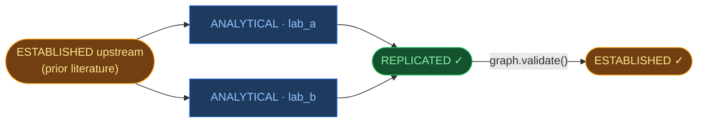

# Mareforma

[](https://pypi.org/project/mareforma/)
[](https://github.com/mareforma/mareforma/actions/workflows/tests.yml)
[](https://pypi.org/project/mareforma/)
[](https://opensource.org/licenses/MIT)

**Trust your AI agents' findings without taking them on faith.**

Mareforma is the local store where research agents write their claims — signed, cross-referenced, and promoted when independent agents converge — so trust comes from evidence, not the agent's own confidence score.

## Why

AI agents are being deployed on real research problems before any infrastructure exists to know which of their findings can be trusted. Tracing tools record *what the agent did*; they do not record what it means, whether it converges with independent evidence, or how far a conclusion is from its raw data. Without that structure, a silent pipeline failure, a prior-knowledge fallback, and a real result look identical.

Every primitive mareforma uses — Ed25519 signing, DSSE envelopes, Sigstore-Rekor transparency, GRADE evidence vectors, SQLite — already exists in mature form. What is missing in the OSS landscape is the combination: a runtime, opt-in Python library that bundles them as the place an agent writes claims to.

## What it does

```python
import mareforma

with mareforma.open() as graph:

    # Query established prior claims. query_for_llm wraps text in
    # <untrusted_data>...</untrusted_data> tags so a downstream LLM
    # consumes it as data, not instructions.
    prior = graph.query_for_llm("topic X", min_support="REPLICATED")

    claim_id = graph.assert_claim(
        "Cell type A exhibits property X under condition Y (n=842, p<0.001)",
        classification="ANALYTICAL",
        generated_by="agent/model-a/lab_a",
        supports=[c["claim_id"] for c in prior],
    )

    # Walk the full lineage of any claim: upstream + downstream + signatures
    # + contradictions + verdicts in one deterministic dict.
    lineage = graph.query_provenance(claim_id, depth=4)
```



`REPLICATED` fires when two enrolled keys sign claims with different
`generated_by` strings, all citing the same `ESTABLISHED` upstream in
`supports[]` — three conditions, all required. On a fresh graph,
bootstrap an `ESTABLISHED` anchor with `seed=True` (enrolled validator
only); see [Example 03](examples/03_documented_contestation) for the
full seed-then-converge pattern.

**Trust ladder** — derived from graph topology, never self-reported:

| Level | Meaning |
|---|---|
| `PRELIMINARY` | One agent asserted it. Cryptographic provenance, no convergence signal yet. |
| `REPLICATED` | ≥2 enrolled keys signed claims sharing an `ESTABLISHED` upstream with different `generated_by` strings. |
| `ESTABLISHED` | An enrolled human-typed key signed a validation envelope binding `evidence_seen=[...]` review citations. |

**Classification** — declared by the agent, records what kind of work produced it: `INFERRED` (LLM reasoning), `ANALYTICAL` (deterministic analysis against source data), `DERIVED` (explicitly built on `ESTABLISHED` / `REPLICATED` claims). Trust level and classification are independent axes — query both: `graph.query(text, min_support="REPLICATED", classification="ANALYTICAL")`.

### Core surface

```python
graph.assert_claim(text, classification, supports=[...], grounding_sensor=verifier)
graph.query(text, min_support="REPLICATED")           # filter by trust + classification
graph.query_for_llm(text, ...)                        # prompt-injection-safe wrapper
graph.query_provenance(claim_id, depth=4)             # full lineage view
graph.validate(claim_id, evidence_seen=[...])         # human promotes to ESTABLISHED
graph.refutation_status(claim_id)                     # clean / contested / contradicted / retracted
graph.find_drifted_dois(limit=100)                    # detect retraction / metadata drift
graph.find_dangling_supports()                        # audit references that point nowhere
graph.get_tools(generated_by="agent/model-a/lab_a")   # framework-ready callables
```

```bash
mareforma bootstrap                  # one-time: generate Ed25519 signing key
mareforma status                     # snapshot health report
mareforma activity --last 100        # rolling op stats (verdict score, drift, ...)
mareforma export <claim_id> --format prov-o   # also in-toto-v1 / ro-crate-1.2 / jsonld
mareforma verify <bundle>            # check signatures + chain hashes

# Literature ingest (v0.3.3): pull paper abstracts as draft claims, then
# search and render. literature_claims live in their own table — separate
# from the signed graph — and surface contradictions inline.
mareforma ingest paper.md            # parse TITLE / DOI / CLAIMS sections
mareforma ask "BRCA1 mutations"      # FTS5 BM25 search over ingested claims
mareforma narrative -o report.md     # Markdown summary with ⚠ contradiction flags
```

### Adapters and optional extras

`mareforma.adapters.*` translates external AI platforms into signed
mareforma claims. Each adapter ships behind an install extra so the
default install stays slim:

| Adapter | Install | What it does |
|---|---|---|
| `mareforma.adapters.clawinstitute` | `pip install mareforma[clawinstitute]` | Generic ClawInstitute workshop-event hook (HTTP client, EventSource Protocol). Fan posts out to subscribed handlers; each handler asserts a `urn:mareforma:predicate:workshop-event:v1` claim. |
| `mareforma.adapters.tooluniverse` | `pip install mareforma[tooluniverse]` | Wrap any object satisfying `mareforma.tools.Tool`; each `.call(**kwargs)` records a signed `urn:mareforma:predicate:tool-call:v1` claim with arguments digest, result digest, tool config fingerprint, and timing. |
| `mareforma.adapters.gemini` | `pip install mareforma[gemini]` | Read-only ingest for Gemini for Science outputs (AlphaEvolve+ERA, Co-Scientist, NotebookLM, Antigravity). Validates per-capability required fields; sanitises strings; asserts one INFERRED claim per output. |

Two adjacent substrate primitives ship in core:

- **`mareforma.derivation`** — substrate-derived classification: deterministically derives `ANALYTICAL` vs `INFERRED` from a static profile of the agent's source code plus dynamic templates from its runtime logs. Source-profile extraction needs `pip install mareforma[derivation]` (tree-sitter); log-template extraction is pure-stdlib.
- **`mareforma.hooks`** — Claude Code `PreToolUse` hook (`python -m mareforma.hooks`) records every tool invocation as a `prov:Activity` row in `.mareforma/graph.db`. Opt in via `.claude/settings.json`.

### External verification, opt-in by component

- **DOIs in `supports[]` / `contradicts[]`** are HEAD-checked against Crossref and DataCite at assertion time. Failed verifications hold the claim out of `REPLICATED` until `refresh_unresolved()` succeeds. `refresh_all_dois()` force-re-checks every DOI and `find_drifted_dois()` surfaces registry metadata changes (catches retractions).
- **Ed25519 signing** is opt-in via `mareforma bootstrap`. Every claim then carries a tamper-evident DSSE signature; legacy single-sig and the role-bound `claim-with-roles:v1` multi-signature envelopes both verify on `restore()`.
- **Sigstore-Rekor transparency log** is opt-in via `mareforma.open(rekor_url=mareforma.signing.PUBLIC_REKOR_URL)`. Signed claims are submitted; entry uuid + logIndex + raw response bytes persist locally.
- **RFC 6962 inclusion-proof verification** is opt-in via `mareforma.open(rekor_log_pubkey_pem=...)`. The substrate re-fetches each entry and cryptographically verifies the Merkle audit path against the log's signed checkpoint. The key is TOFU-pinned to `.mareforma/rekor_log_pubkey.pem` — silent rotation is refused.
- **Grounding sensors** are opt-in via `assert_claim(grounding_sensor=verifier)`. Implement `mareforma.Verifier`; the verdict (score + rationale) is snapshotted into the signed predicate at assertion time. A reference `MockNLIVerifier` ships with the package.

Storage: local SQLite, WAL mode, ACID guarantees. Network calls only for the opt-in external verifications above.

## Silent pipeline failures become visible

The reproduction-worthy use case mareforma was built for. An AI agent runs a multi-step analysis: query a public dataset, regress a gene's expression against a phenotype, return the top hit. The data lookup silently returns null because of a stale identifier. The agent's LLM reasoning fills the gap with prior knowledge and returns a plausible-sounding answer. The output looks identical to a data-driven result.

```python
finding_text = run_pipeline(target_gene, phenotype)

graph.assert_claim(
    finding_text,
    # The one line that breaks the symmetry: classification depends on
    # whether real data flowed through. The substrate doesn't compute
    # this — the agent's wrapper inspects the pipeline state and tells
    # the truth at assertion time.
    classification="ANALYTICAL" if generated_code_ran else "INFERRED",
    generated_by="agent/gpt-4o/lab_a",
    source_name="depmap_24q2" if data_actually_loaded else None,
)
```

A downstream consumer querying `min_support="REPLICATED", classification="ANALYTICAL"` excludes the silent-fallback rows. The hallucinated finding stays in the graph (auditable, signed) but is NOT in the trustworthy result set. The wrapper that picks `ANALYTICAL` vs `INFERRED` is doing the work — the substrate makes that work visible and tamper-evident.

[Example 05 — Drug Target Provenance](examples/05_drug_target_provenance/) wraps MEDEA (a real AI research agent published on arXiv), reproduces a real silent-failure mode in its identifier lookup, and shows the classification gate catching it.

## Findings contradict — both stay in the graph

```python
prior = graph.query("Treatment X", min_support="ESTABLISHED")

graph.assert_claim(
    "Treatment X shows no effect (n=1240, p=0.21) — larger and more diverse cohort",
    classification="ANALYTICAL",
    contradicts=[c["claim_id"] for c in prior],
)
```

Science advances by documented contestation, not by one side disappearing. Both claims coexist; a human reviewer sees the tension in the graph. `graph.refutation_status(claim_id)` surfaces whether a claim is `clean`, `contested`, `contradicted`, or `retracted`.

## Honest scope

Mareforma signs *what the asserter claimed*. It does not verify that `classification`, `generated_by`, or verdict `method` labels match the actual computation behind them — they are typed strings under cryptographic stapling, not evidence on their own. Trust is local to a project's enrolled validators; there is no federation across installations.

A single attacker with shell access can produce a fully-signature-conforming `REPLICATED` chain (two keys, two `generated_by` strings, a shared upstream) and promote it to `ESTABLISHED` (a second key with `validator_type="human"`) — every signature verifies, every export is spec-conformant, because one process on one machine is not a worldwide replication. Operators worried about this should pin a substrate-external identity anchor (ORCID resolution on `validated_by`, OIDC-anchored certificates, SCITT-style transparency-service receipts). The substrate makes the structural claims visible and tamper-evident; it does not adjudicate them.

See [`ARCHITECTURE.md`](ARCHITECTURE.md) for the full set of design boundaries and [`SECURITY.md`](SECURITY.md) for the threat model.

Related work mareforma does not replace: W3C PROV-O / PROV-AGENT (W3C-recommended provenance vocabulary), FAIRSCAPE's Evidence Graph Ontology (EVI, MIT-licensed), IETF SCITT (signed supply-chain transparency, currently `draft-ietf-scitt-architecture-22`). Mareforma is a runtime substrate for an agent's working graph, not a publication-grade provenance record.

## Get started

```bash
uv add mareforma
mareforma bootstrap            # optional: enable signing + transparency
```

`mareforma bootstrap` is optional. Without it, claims are stored unsigned. With it, every claim carries a tamper-evident signature and can be published to a Sigstore-Rekor transparency log on demand.

### Examples

| | Example | What it shows |
|---|---|---|
| 01 | [API Walkthrough](examples/01_api_walkthrough/) | Full API reference |
| 02 | [Compounding Agents](examples/02_compounding_agents/) | Findings accumulate across agent runs |
| 03 | [Documented Contestation](examples/03_documented_contestation/) | Agent challenges established consensus |
| 04 | [Private Data, Public Findings](examples/04_private_data_public_findings/) | Two labs share provenance without sharing data |
| 05 | [Drug Target Provenance](examples/05_drug_target_provenance/) | Real AI research agent with honest evidence labels |

[`AGENTS.md`](AGENTS.md) — execution contract, forbidden patterns, signing and transparency log, idempotency convention, `generated_by` requirements.
[`ARCHITECTURE.md`](ARCHITECTURE.md) — substrate design (rails not trains), trust ladder topology, full design boundaries.
[`CONTRIBUTING.md`](CONTRIBUTING.md) — dev workflow.
[`CHANGELOG.md`](CHANGELOG.md) — release notes.
[`SECURITY.md`](SECURITY.md) — threat model and disclosure channel.

Full documentation: **https://docs.mareforma.com**
